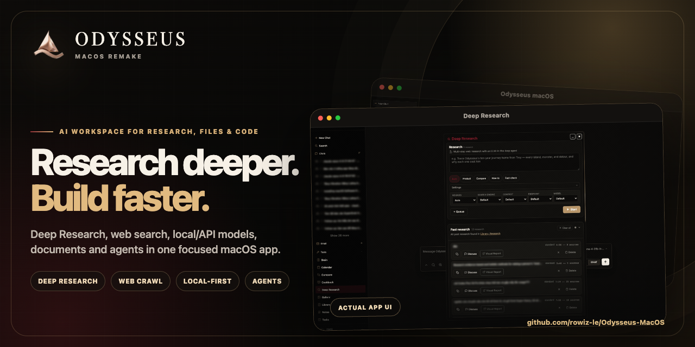
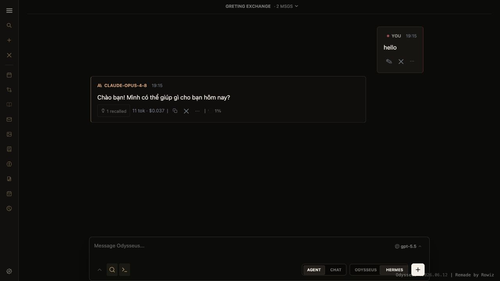
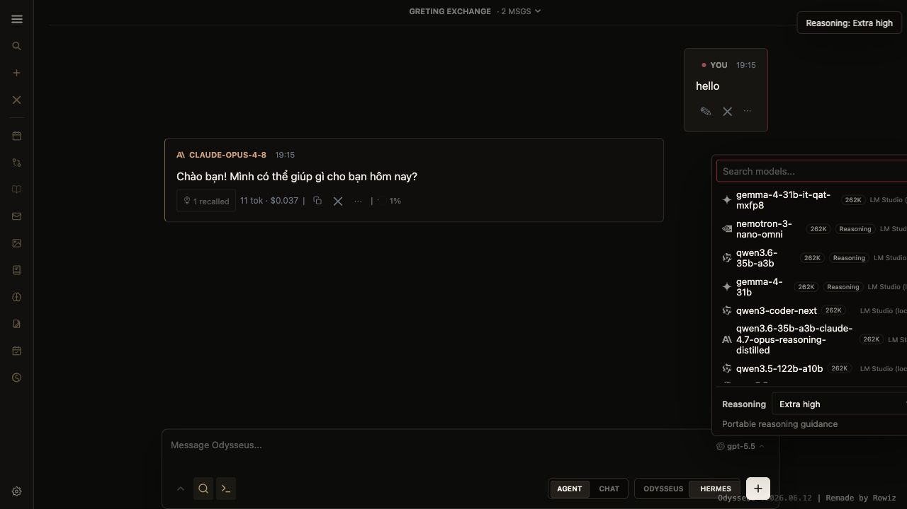
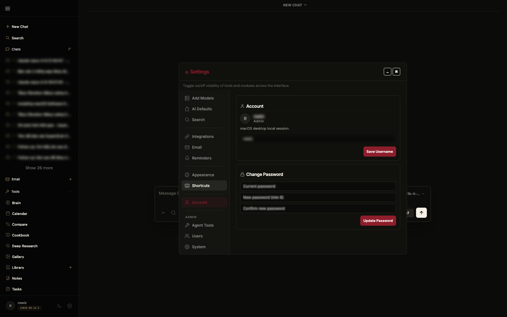
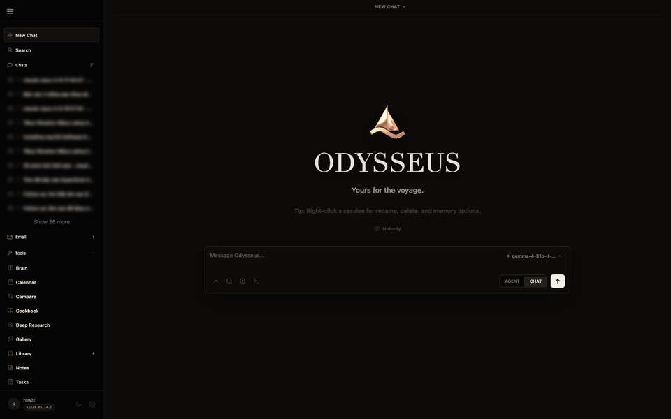
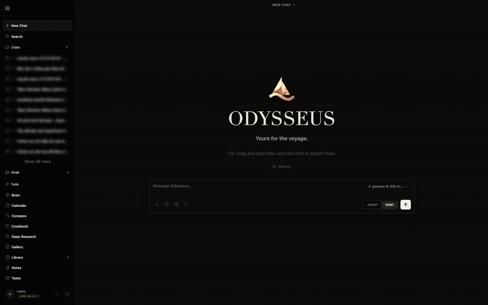
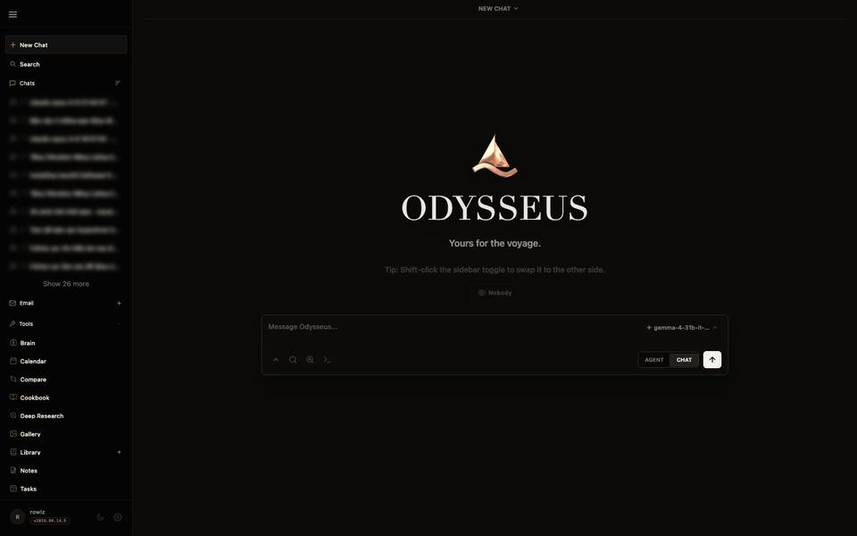

# Odysseus macOS



<p align="center">
  <a href="https://github.com/rowiz-le/Odysseus-MacOS/releases/download/v2026.06.15.2/Odysseus-macOS-2026.06.15.2.dmg">
    
  </a>
  <a href="https://github.com/rowiz-le/Odysseus-MacOS/releases/tag/v2026.06.15.2">
    
  </a>
</p>

**Odysseus macOS** là bản remake giao diện và đóng gói macOS cho Odysseus:
thân thiện hơn, có app launcher riêng, chạy local-first, và có file `.dmg`
kéo-thả để cài nhanh trên macOS.

**Tải nhanh:** [Odysseus-macOS-2026.06.15.2.dmg](https://github.com/rowiz-le/Odysseus-MacOS/releases/download/v2026.06.15.2/Odysseus-macOS-2026.06.15.2.dmg)

**Hướng dẫn sử dụng:** [docs/HUONG_DAN_SU_DUNG_VI.md](docs/HUONG_DAN_SU_DUNG_VI.md)

> Lưu ý: bản `.dmg` hiện tại cần Python 3.11+ trên máy Mac ở lần chạy đầu để
> bootstrap môi trường riêng trong `~/Library/Application Support/Odysseus`.

Dự án này được remake từ Odysseus gốc của Pewdiepie:
[pewdiepie-archdaemon/odysseus](https://github.com/pewdiepie-archdaemon/odysseus).

Odysseus là AI workspace tự host: trải nghiệm gần với ChatGPT/Claude, nhưng
chạy trên máy của bạn, với dữ liệu của bạn, ưu tiên local-first và privacy-first.

## Điểm mới trong bản macOS
  - **Giao diện mới** -- dark UI gọn hơn, sidebar rõ hơn, wordmark/branding theo phong cách sang hơn.
  - **macOS app launcher** -- mở như app desktop, tự chạy Odysseus trên localhost.
  - **Bản cài DMG** -- có file `.dmg` để kéo `Odysseus.app` vào Applications.
  - **Logo/icon mới** -- favicon, app icon, manifest icon đã đồng bộ theo Odysseus macOS.
  - **Hermes runtime** -- có cầu nối thử nghiệm sang Hermes Agent gateway cho Agent mode.

## Features
  - **Chat** -- chat with any local model or API; adding them is super simple.<br>　<sub>vLLM · llama.cpp · Ollama · OpenRouter · OpenAI</sub>
  - **Agent** -- hand it tools and let it run the whole task itself.<br>　<sub>built on [opencode](https://github.com/anomalyco/opencode) · MCP · web · files · shell · skills · memory</sub>
  - **Cookbook** -- Scans your hardware, recommends models, click to download and serve.. easy!<br>　<sub>built on [llmfit](https://github.com/AlexsJones/llmfit) · VRAM-aware · GGUF / FP8 / AWQ · fit scoring · vLLM / llama.cpp serving</sub>
  - **Deep Research** -- multi-step runs that gather, read, and synthesize sources into a nice visual report.<br>　<sub>adapted from [Tongyi DeepResearch](https://github.com/Alibaba-NLP/DeepResearch)</sub>
  - **Compare** -- a fun tool to compare models side by side. Test completely blind, no bias!<br>　<sub>multi-model · blind test · synthesis</sub>
  - **Documents** -- YOU write the text, AI is there to assist, not the opposite.<br>　<sub>multi-tab editor · markdown · HTML · CSV · syntax highlighting · AI edits · suggestions</sub>
  - **Memory / Skills** -- Persistent memory and skills, your agent evolves over time as it better understands you and your tasks!<br>　<sub>ChromaDB · fastembed (ONNX) · vector + keyword retrieval · import/export</sub>
  - **Email** -- IMAP/SMTP inbox with AI triage built in: urgency reminders, auto-tag, auto-summary, auto-reply drafts, auto-spam.<br>　<sub>IMAP · SMTP · per-account routing · CalDAV-aware</sub>
  - **Notes & Tasks** -- Quick notes with reminders, a todo list, and scheduled tasks the agent can act on.<br>　<sub>note pings · checklist · cron-style tasks · ntfy / browser / email channels</sub>
  - **Calendar** -- Local-first calendar with CalDAV sync to Radicale / Nextcloud / Apple / Fastmail.<br>　<sub>CalDAV pull · .ics import/export · per-calendar colors · agent-aware</sub>
  - **Works on mobile** -- looks and runs great on your phone, not just desktop.<br>　<sub>responsive · installable (PWA) · touch gestures</sub>
  - **Extras** -- more to explore, happy if you give it a go!<br>　<sub>image editor · theme editor · file uploads (vision + PDF) · web search · presets · sessions · 2FA</sub>

## Giao diện hiện tại

Toàn bộ ảnh và demo dưới đây được chụp trực tiếp từ **Odysseus macOS
v2026.06.15.2**, không dùng ảnh AI hay giao diện mô phỏng. Tên chat, báo cáo và
tài liệu cá nhân đã được làm mờ trước khi phát hành.

### Tech demo


[Xem bản MP4](docs/tech-demo.mp4) · [Xem bản WebM](docs/tech-demo.webm)

### Chat & Agent



### Model local, Context Window & Reasoning

Odysseus tự đồng bộ model từ LM Studio, hiển thị context window của từng
model và cho phép chọn mức suy luận phù hợp.



### Tài khoản & bảo mật

Đổi mật khẩu yêu cầu nhập mật khẩu hiện tại. Bản macOS cũng hỗ trợ xác thực
sinh trắc học qua Touch ID trên thiết bị tương thích.



### Khám phá workspace

<table>
  <tr>
    <td width="50%"><strong>Deep Research</strong><br></td>
    <td width="50%"><strong>Model Compare</strong><br></td>
  </tr>
  <tr>
    <td width="50%"><strong>Documents</strong><br></td>
    <td width="50%"><strong>Notes</strong><br></td>
  </tr>
  <tr>
    <td width="50%"><strong>Gallery</strong><br></td>
    <td width="50%"><strong>Theme Studio</strong><br></td>
  </tr>
</table>

## Quick Start

Defaults work out of the box — clone, run, configure inside the app.
Open the **Settings** panel after first login to point Odysseus at your LLM
server, search provider, email account, etc. Only touch `.env` if you need
to override deployment-level things like `AUTH_ENABLED`, `DATABASE_URL`,
or pre-seed `ODYSSEUS_ADMIN_PASSWORD` (otherwise an initial password is
generated and printed on first boot).

### Option 1: Docker (recommended)
```bash
git clone <your-odysseus-repo-url>
cd odysseus
cp .env.example .env       # optional, but recommended for explicit defaults
docker compose up -d --build
```
Compose starts Odysseus, ChromaDB, SearXNG, and ntfy. First run does a full
image build. Open `http://localhost:7000` after the containers are healthy.

Cookbook remote servers use an Odysseus-owned SSH key from `./data/ssh`
inside Docker. In **Cookbook -> Settings -> Servers**, generate/copy the
public key and add it to the remote server's `~/.ssh/authorized_keys`.
After generating the key, you can also install it from the host with:
```bash
ssh-copy-id -i data/ssh/id_ed25519.pub user@server
```
Cookbook local downloads are stored in `./data/huggingface`, mounted as
`~/.cache/huggingface` inside the Odysseus container.

Useful checks:
```bash
docker compose ps
docker compose logs --tail=120 odysseus
docker compose logs odysseus | grep -E 'ChromaDB|MemoryVectorStore|DEGRADED'
docker compose exec odysseus python -c "from services.hwfit.models import get_models; print(len(get_models()))"
```

Expected vector-memory startup lines in Docker:
```text
ChromaDB connected: chromadb:8000
MemoryVectorStore initialized
```

The Cookbook model catalog check should print a non-zero count. If it prints
`0`, rebuild the Odysseus image with `docker compose build --no-cache odysseus`.

### Option 2: Manual install — Linux / macOS
**Requirements:** Python 3.11+. On Linux/Termux, Cookbook also requires `tmux`
for background model downloads and serves.

Install system packages first:
```bash
# Debian/Ubuntu
sudo apt install tmux

# Arch
sudo pacman -S tmux

# Fedora
sudo dnf install tmux
```

Then install Odysseus:
```bash
git clone <your-odysseus-repo-url>
cd odysseus
python3 -m venv venv
source venv/bin/activate
pip install -r requirements.txt
python setup.py            # creates data dirs and prints an initial admin password
uvicorn app:app --host 0.0.0.0 --port 7000
```

### Option 3: macOS app distribution
To build a drag-and-drop macOS installer:

```bash
scripts/build_macos_distribution.sh
```

The output is `dist/Odysseus-macOS-<version>.dmg`. Drag `Odysseus.app` to
Applications, then open it. On first launch the app bootstraps a private
environment under `~/Library/Application Support/Odysseus`; Python 3.11+ must
be installed on the target Mac for that bootstrap step.

### Option 4: Manual install — Windows (PowerShell)
```powershell
git clone <your-odysseus-repo-url>
cd odysseus
python -m venv venv
venv\Scripts\Activate.ps1
pip install -r requirements.txt
python setup.py
uvicorn app:app --host 0.0.0.0 --port 7000
```

Open `http://localhost:7000`, log in with the generated admin password,
and configure everything else inside **Settings**.

## Security Notes
Odysseus is a self-hosted workspace with powerful local tools: shell access, file uploads, model downloads, web research, email/calendar integrations, and API tokens. Treat it like an admin console.

- Keep `AUTH_ENABLED=true` for any network-accessible deployment.
- Do not expose it directly to the public internet without HTTPS and a trusted reverse proxy.
- Keep `data/`, `.env`, logs, databases, and uploaded/generated media out of Git. They are ignored by default.
- Review `data/auth.json` after first boot: disable open signup unless you intentionally want it, make only your own account admin, and keep demo/test accounts non-admin.
- Non-admin users do not get shell/Python/file read/write by default, and admin-only routes/tools such as MCP management, API tokens, webhooks, model/cookbook serving, backup/vault, and app settings are admin-gated. Other features are controlled by per-user privileges, so review each user's privileges before exposing a deployment.
- Rotate any API keys or tokens that were ever pasted into a shared chat, demo, screenshot, or log.
- If you enable API tokens or webhooks, create separate tokens per integration and delete unused ones.
- Prefer binding manual development runs to `127.0.0.1`; bind to `0.0.0.0` only when you intentionally want LAN/reverse-proxy access.
- Before publishing a fork, run `git status --short` and confirm no private files from `.env`, `data/`, `logs/`, uploads, backups, or local databases are staged.

### Putting it behind HTTPS
Odysseus serves plain HTTP on its port. That's fine for `localhost` and trusted LAN/VPN use, but browsers will warn ("Password fields present on an insecure page") and the login + API tokens travel in cleartext. For anything reachable outside your machine — including a Tailscale IP shared with other devices — put a TLS-terminating reverse proxy in front.

Shortest path with [Caddy](https://caddyserver.com/) (auto-renews Let's Encrypt certs):

```caddy
odysseus.example.com {
  reverse_proxy localhost:7000
}
```

For a LAN-only Tailscale deployment, Caddy + [tailscale-cert](https://caddyserver.com/docs/caddyfile/options#auto-https) or the built-in MagicDNS HTTPS feature both work. nginx/Traefik configs are similar — proxy `localhost:7000`, terminate TLS at the proxy. Once that's in place, the browser warning goes away and your login is encrypted.

## Contributing
Help is welcome. The best entry points are fresh-install testing, provider setup
bugs, mobile/editor polish, docs, and small focused refactors. See
[ROADMAP.md](ROADMAP.md) for the current help-wanted list.

## Configuration
Most setup is done inside the app with `/setup` or **Settings**. Use `.env`
for deployment-level defaults and secrets you want present before first boot.
Key settings:

| Variable | Default | Description |
|---|---|---|
| `LLM_HOST` | `localhost` | Your LLM server (e.g. `llm-host.local:8000`) |
| `LLM_HOSTS` | -- | Comma-separated list for model discovery |
| `OLLAMA_BASE_URL` | -- | Optional local/remote Ollama server to include in discovery |
| `OLLAMA_API_KEY` | -- | Optional Ollama Cloud key for automatic cloud model discovery |
| `NVIDIA_API_KEY` | -- | Optional NVIDIA NIM key. Auto-adds `https://integrate.api.nvidia.com/v1`; generate one at [build.nvidia.com](https://build.nvidia.com/settings/api-keys). |
| `OPENAI_API_KEY` | -- | Optional OpenAI key. Prefer adding providers in the app unless pre-seeding. |
| `SEARXNG_INSTANCE` | `http://localhost:8080` | SearXNG URL. Docker overrides this to `http://searxng:8080`. |
| Search API keys | -- | Optional `DATA_BRAVE_API_KEY`, `GOOGLE_API_KEY` + `GOOGLE_PSE_CX`, `TAVILY_API_KEY`, `SERPER_API_KEY`, `EXA_API_KEY`. Settings → Search can run one engine or **All available engines**. |
| `AUTH_ENABLED` | `true` | Enable/disable login |
| `LOCALHOST_BYPASS` | `false` | Development-only auth bypass for loopback requests. Keep false for shared/network deployments. |
| `DATABASE_URL` | `sqlite:///./data/app.db` | Database connection string |
| `CHROMADB_HOST` | `localhost` | ChromaDB host for vector memory. Docker overrides this to `chromadb`. |
| `CHROMADB_PORT` | `8100` | ChromaDB port for manual host runs. Docker overrides this to `8000`. |
| `EMBEDDING_URL` | -- | OpenAI-compatible embeddings endpoint |

### Bundled services
Docker Compose includes these by default:

  - **ChromaDB** → vector store for semantic memory. In Docker, Odysseus connects to `chromadb:8000`; from the host it is exposed as `localhost:8100`.
  - **SearXNG** → meta search for web search. In Docker, Odysseus connects to `searxng:8080`; from the host it is exposed only on `127.0.0.1:8080`.
  - **ntfy** → local notification service, exposed as `localhost:8091`.

### Optional external services
  - **Ollama** → local LLM server -- [ollama.ai](https://ollama.ai)

## Architecture
```
app.py                   # FastAPI entry point
core/      auth, database, middleware, constants
src/       llm_core, agent_loop, agent_tools, chat_processor, search/
routes/    chat, session, document, memory, model … endpoints
services/  docs, memory, search, hwfit (Cookbook) …
static/    index.html + app.js + style.css + js/ (modular front-end)
docs/      landing page (index.html) + preview clips
```

## Data
All user data lives in `data/` (gitignored): `app.db` (sessions, messages, documents),
`memory.json`, `presets.json`, `uploads/`, `personal_docs/`, `chroma/`, `settings.json`.

## License
MIT -- see [LICENSE](LICENSE) and [ACKNOWLEDGMENTS.md](ACKNOWLEDGMENTS.md).

```
                                  |
                                 |||
                                |||||
                  |    |    |   |||||||
                 )_)  )_)  )_)   ~|~
                )___))___))___)\  |
               )____)____)_____)\\|
             _____|____|____|_____\\\__
             \                       /
       ~^~^~~^~^~~^~^~~^~^~~^~^~~^~^~~^~^~~^~^~
               ~^~  all aboard!  ~^~
       ~^~^~~^~^~~^~^~~^~^~~^~^~~^~^~~^~^~~^~^~
```
